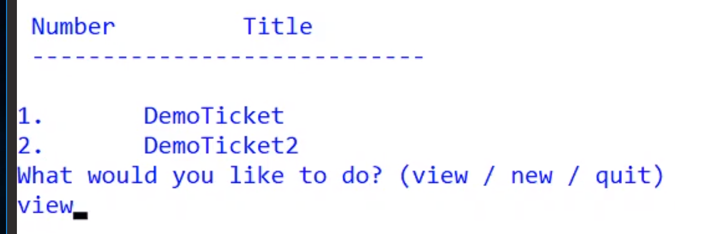

# TicketTracker

It is time to build a small application designed to keep track of a series of tickets. 

Features
This app should have several menus where users can either

- View all tickets
  - View a ticket
    - Close Ticket
- Create a ticket
- Quit

For a walkthrough of this project please view the videos in the [codeworks backpack](https://backpack.boisecodeworks.com/#/videos/Getting%20Started%20with%20CSharp/5c911a0a9bdc1800153a3fc9)

!(backpack)[backpack.png]
